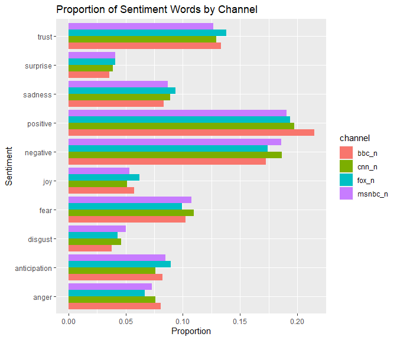

<!-- README.md is generated from README.Rmd. Please edit that file -->

# Chyrons

<!-- badges: start -->

<!-- badges: end -->

The goal of the Chyrons package, is to provide an example as to how to
work with textual data – in the form of chyrons.

## Installation

You can install the released version of Chyrons from
[CRAN](https://CRAN.R-project.org) with:

``` r
install.packages("Chyrons")
```

And the development version from [GitHub](https://github.com/) with:

``` r
# install.packages("devtools")
devtools::install_github("thetonyni/Chyrons")
```

## Example

A brief example to investigate whether or not if different news channels
had tendencies toward using certain words more than others is conducted
below through a sentiment analysis with the words used in the chyrons
for the four news networks available in the dataset.

``` r
#unnesting words
word_counts <- Chyrons %>%
  tidytext::unnest_tokens(word, text) %>% #unnest
  anti_join(stop_words, by = "word") %>% #remove stopwords
  count(channel, word, sort = TRUE) %>%
  ungroup()

#creating datasets to separate by channel
cnn_words <- word_counts %>%
  filter(channel == "CNNW")
msnbc_words <- word_counts %>%
  filter(channel == "MSNBCW")
bbc_words <- word_counts %>%
  filter(channel == "BBCNEWS")
fox_words <- word_counts %>%
  filter(channel == "FOXNEWSW")
```

``` r
#get nrc sentiments
nrc_lexicon <- get_sentiments("nrc")

#join the word frequency dataset by nrc lexicon
nrc_bbc<- left_join(bbc_words, nrc_lexicon, by = "word")
nrc_cnn<- left_join(cnn_words, nrc_lexicon, by = "word")
nrc_fox<- left_join(fox_words, nrc_lexicon, by = "word")
nrc_msnbc<- left_join(msnbc_words, nrc_lexicon, by = "word")

#summarize sentiments counts
nrc_bbc_data <- nrc_bbc %>%
  filter(sentiment != "NA") %>%
  group_by(sentiment) %>%
  summarize(n = n())%>%
  arrange(desc(n)) %>%
  rename("bbc_n" = "n")
#> `summarise()` ungrouping output (override with `.groups` argument)

nrc_cnn_data <- nrc_cnn %>%
  filter(sentiment != "NA") %>%
  group_by(sentiment) %>%
  summarize(n = n())%>%
  arrange(desc(n)) %>%
  rename("cnn_n" = "n")
#> `summarise()` ungrouping output (override with `.groups` argument)

nrc_fox_data <- nrc_fox %>%
  filter(sentiment != "NA") %>%
  group_by(sentiment) %>%
  summarize(n = n())%>%
  arrange(desc(n)) %>%
  rename("fox_n" = "n")
#> `summarise()` ungrouping output (override with `.groups` argument)

nrc_msnbc_data <- nrc_msnbc %>%
  filter(sentiment != "NA") %>%
  group_by(sentiment) %>%
  summarize(n = n())%>%
  arrange(desc(n)) %>%
  rename("msnbc_n" = "n")
#> `summarise()` ungrouping output (override with `.groups` argument)
```

``` r
#combining channel sentiment counts
nrc_combined_data <- cbind(nrc_bbc_data, nrc_cnn_data, 
                           nrc_fox_data, nrc_msnbc_data)

nrc_combined_data <- nrc_combined_data %>%
  select(c(1, 2, 4, 6, 8))

nrc_combined_long <- gather(nrc_combined_data, 
                            key = "channel", 
                            value = "count", -sentiment)
```

``` r
#getting proportion by channel
nrc_combined_long <- nrc_combined_long %>% 
   group_by(channel) %>%
   mutate(prop = count/sum(count))

#plotting combined sentiment (by proportion)
ggplot(nrc_combined_long, aes(x = sentiment)) +
  geom_col(aes(fill=channel, y = prop), position = "dodge") +
  coord_flip() +
  xlab("Sentiment") +
  ylab("Proportion") +
  ggtitle("Proportion of Sentiment Words by Channel")
```



From the barplot there aren’t any glaring differences between any of the
four channels.

We can see that Fox uses more trust, sadness, joy, and anticipation
words than the other 3 channels, but only by a small margin.

BBC seems to use far more positive words than the other 3 channels, but
also uses anger words more than the other 3 channels as well.

CNN and MSNBC are both tied for using the highest proportion of negative
words amongst all 4 channels.

This is just an introductory example as to how to work with the chyrons
dataset provided in this package.
